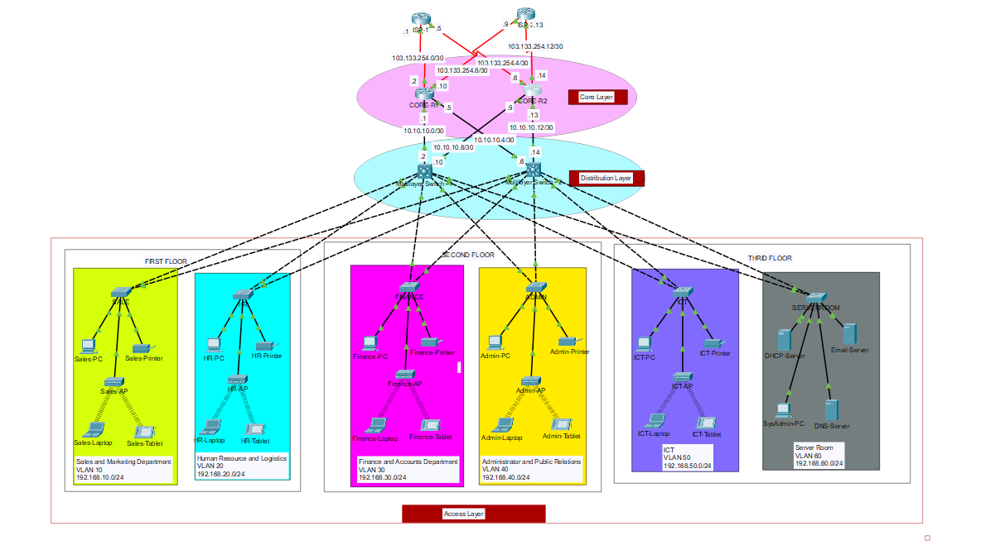

# Company Business System Network Design
 Enterprise Networking Projects/ Cisco Packet Tracer Projects (Project #6)

> In the Case Study and Requirements the Base Network is 172.16.1.0 but I have use 192.168.0.0

> Public IP addresses are give 195.136.17.0/30, 
195.136.17.4/30, 195.136.17.8/30 and 195.136.17.12/30
but I have use 103.133.254.0/30, 103.133.254.4/30, 103.133.254./30, 103.133.254.12/30.

> For ICT, Server Room and each depertment I have taken 256 host. So that we can increase the number of device if needed.

> For more information check report.

> SSH is enabled only for Finace and Admin.

## Project #6 Case Study and Requirements

A trading floor Support center employs 600 staff. They have recently expanded and as a result, need to move to a new 
building. A building has been identified but has no network. This means that before they can make to move out, new 
network service needs to be designed and implemented in the new building. Existing Network comprises of the following 
elements: The new building is expected to have three floors with two departments in each for example; 
1. First floor- (Sales and Marketing Department-120 users expected, Human Resource and Logistics Department 120 users expected).
2. Second floor- (Finance and Accounts Department-120 users expected, Administrator and Public Relations 
Department-120 users expected).
3. Third floor- (ICT-120 users expected, Server Room-12 devices expected).

Therefore, as a key member of the Networks Team, you have been tasked to design a network for the new building. At this 
stage, logical design is required, which shows the measures that you would put in place to ensure that the new network 
meets the current business need and is future-proofed:

* Use Cisco Packet Tracer to design and implement the network solution.
* Use hieratical model providing redundancy at every layer i.e. two routers and two multilayer switches are expected 
to be used to provide redundancy.
* The network is also expected to connect to at least two ISPs to provide redundancy and each router to the 
connected to the two ISPs.
* Each department is required to have a wireless network for the users.
* Each department should be in a different VLAN and in different subnetwork.
* Provided a base network of 172.16.1.0, carry out subnetting to allocate the correct number of IP addresses to each 
department.
* The company network is connected to the static, public IP addresses (Internet Protocol) 195.136.17.0/30, 
195.136.17.4/30, 195.136.17.8/30 and 195.136.17.12/30 connected to the two Internet providers.
* Configure basic device settings such as hostnames, console password, enable password, banner messages, disable 
IP domain lookup.
* Devices in all the departments are required to communicate with each other with the respective multilayer switch 
configured for inter-VLAN routing.
* The Multilayer switches are expected to carry out both routing and switching functionalities thus will be assigned IP 
addresses.
* All devices in the network are expected to obtain an IP address dynamically from the dedicated DHCP servers 
located at the server room.
* Devices in the server room are to be allocated IP address statically.
* Use OSPF as the routing protocol to advertise routes both on the routers and multilayer switches.
* Configure SSH in all the routers and layer three switches for remote login.
* Configure port-security for the Finance and Accounts department to allow only one device to connect to a 
switchport, use sticky method to obtain mac-address and violation mode shutdown.
* Configure PAT to use the respective outbound router interface IPv4 address, implement the necessary ACL rule.
* Test Communication, ensure everything configured is working as expected.

Technologies Implemented

1. Creating a network topology using Cisco Packet Tracer.
2. Hierarchical Network Design.
3. Connecting Networking devices with Correct cabling.
4. Configuring Basic device settings.
5. Creating VLANs and assigning ports VLAN numbers.
6. Subnetting and IP Addressing.
7. Configuring Inter-VLAN Routing on the Multilayer switches (Switch Virtual Interface).
8. Configuring Dedicated DHCP Server device to provide dynamic IP allocation.
9. Configuring SSH for secure Remote access.
10. Configuring OSPF as the routing protocol.
11. Configuring NAT Overload(Port Address Translation PAT).
12. Configuring standard and extended Access Control Lists ACL.
13. Configuring switchport security or Port-Security on the switches.
14. Configuring WLAN or wireless network (Cisco Access Point).
15. Host Device Configurations.
16. Configuring ISP routers.
17. Test and Verifying Network Communication.

I have followed [this video](https://www.youtube.com/watch?v=eqEd84yeRxg&t=8s).

### Topology
